# Отчет по практической работе №4

## Выполнил: Элякова Алеся Львовна

## Группа: БСБО-16-23

## Дата выполнения: 19.05.2026

### 1. Настройка хранилища

#### 1.1 Выбранный вариант хранилища

Вариант А: Local Path Provisioner

#### 1.2 StorageClass

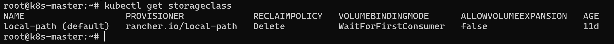

#### 1.3 Тестовый PVC

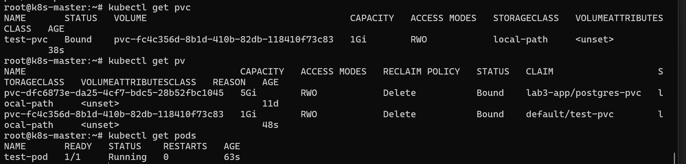

### 2. Установка Helm

#### 2.1 Версия Helm

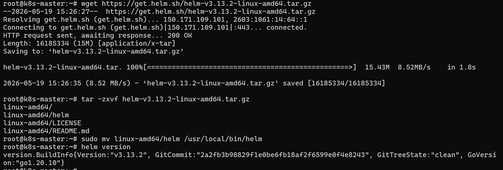

#### 2.2 Репозитории

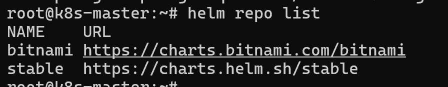

### 3. Создание собственного Helm-чарта

#### 3.1 Структура чарта

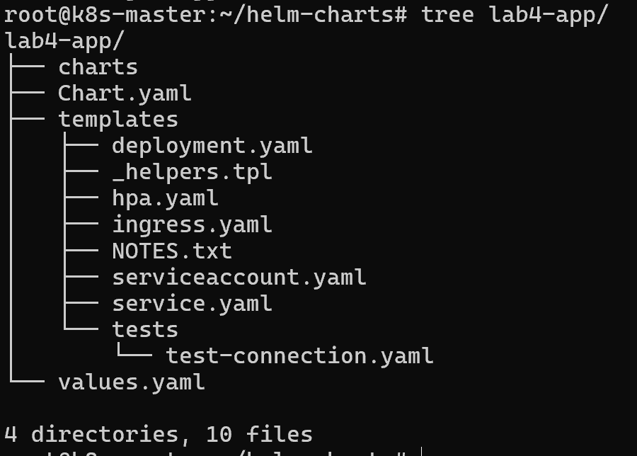

#### 3.2 Установка чарта

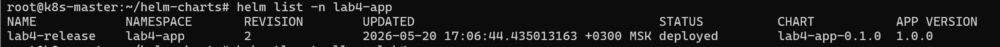

#### 3.3 Сгенерированные ресурсы

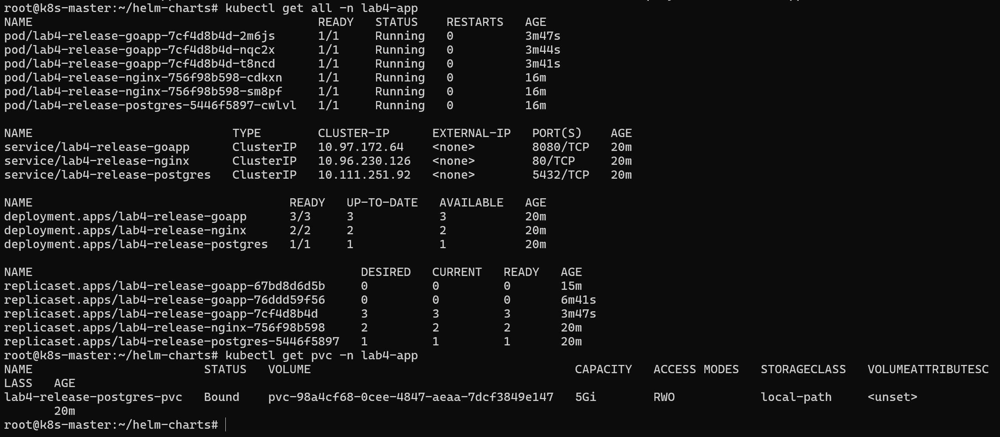

### 4. PersistentVolumes

#### 4.1 PV и PVC

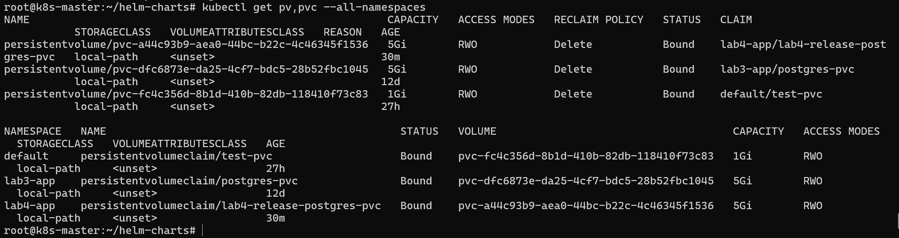

#### 4.2 Тест сохранности данных

API в Go приложении не работает, поэтому я добавил нового пользователя через psql:
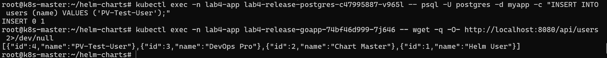
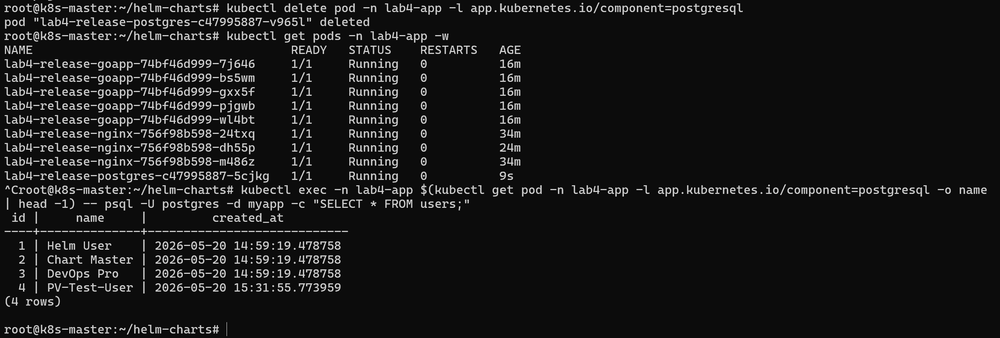

#### 4.3 Тест миграции (если выполнялся)

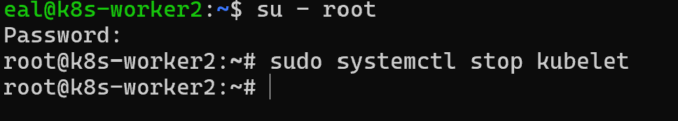
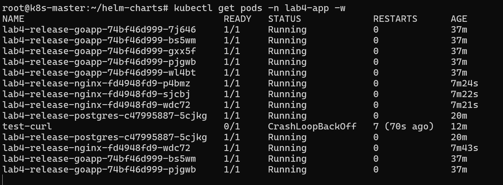

### 5. Управление релизами

#### 5.1 История обновлений

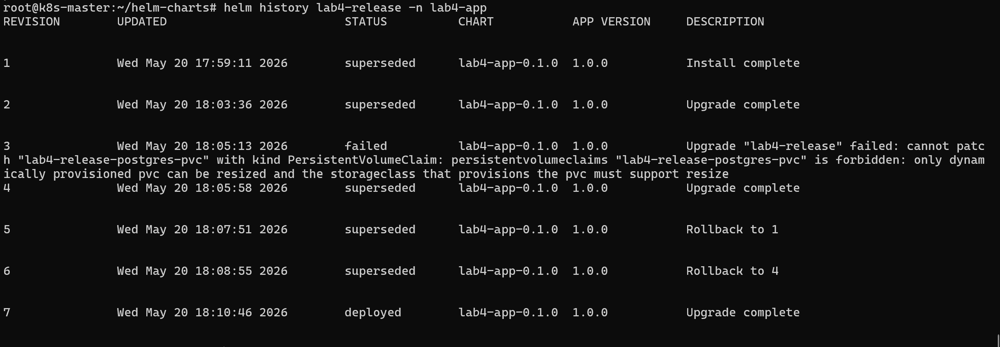

#### 5.2 Результат отката

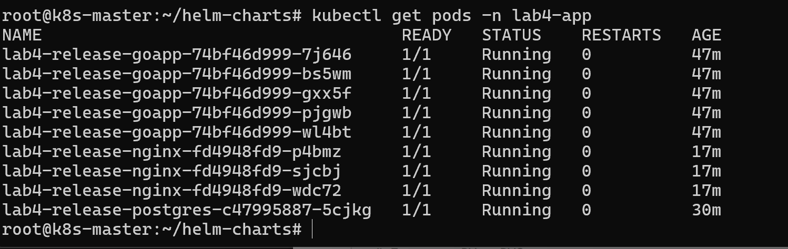

### 7. Скриншоты

#### 7.1 Главная страница приложения

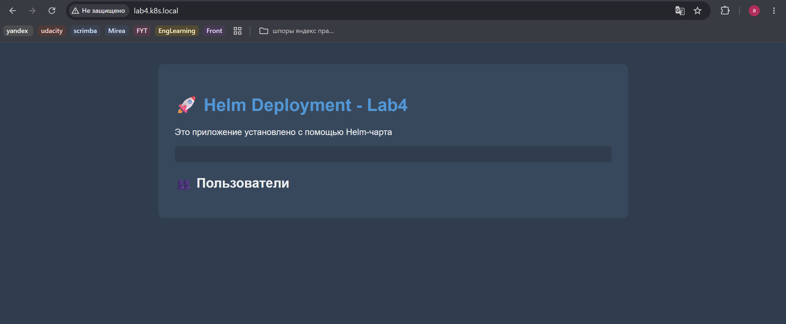

#### 7.2 Дашборд с PVC информацией

Дашборд не работает из-за проблем с Go кодом. Однако Helm кластер может отобразить информацию:
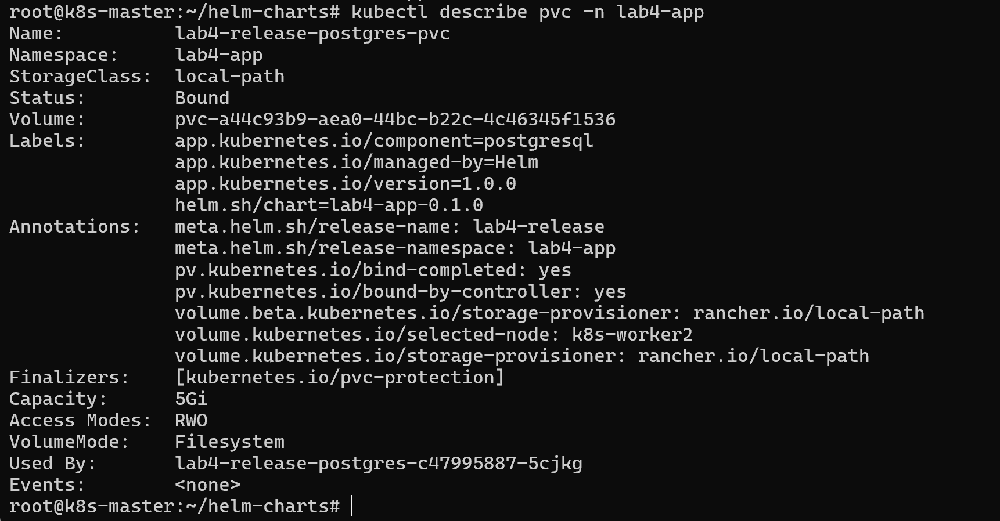

#### 7.3 Данные в PostgreSQL после миграции

Также пользователи не отображаются из-за проблем в Go коде. Однако данные о пользователях хранятся в postgres подах:
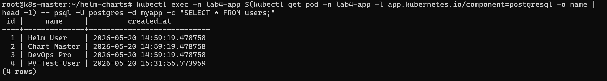

### 8. Ответы на контрольные вопросы

1. В чем разница между emptyDir, hostPath и PersistentVolume?

**emptyDir** - временный том, создаётся вместе с подом и уничтожается вместе с ним. Данные живут только пока под запущен, используется для временных файлов или обмена данными между контейнерами внутри пода.

**hostPath** - монтирует директорию прямо с файловой системы ноды. Данные сохраняются после перезапуска пода, но привязаны к конкретной ноде - если под переедет на другую ноду, данные будут недоступны.

**PersistentVolume (PV)** - независимый ресурс кластера, не привязан ни к поду ни к ноде. Данные сохраняются при перезапуске и миграции пода, управляется через PVC.

---

2. Как работает динамическое предоставление томов (dynamic provisioning)?

Без динамического provisioning администратор должен вручную создавать PV заранее. При динамическом provisioning всё происходит автоматически: пользователь создаёт PVC с указанием StorageClass, Kubernetes обращается к provisioner, provisioner автоматически создаёт PV и связывает его с PVC.

---

3. Что такое StorageClass и зачем он нужен?

StorageClass - это шаблон для создания томов, который описывает какой provisioner использовать, тип хранилища и его параметры. Позволяет иметь несколько классов хранилищ и выбирать нужный при создании PVC. В данной практике использовался `local-path`.

---

4. Какие преимущества дает Helm по сравнению с набором YAML-файлов?

- Одни и те же манифесты переиспользуются с разными значениями через `values.yaml`.

- Helm отслеживает историю установок, можно откатиться на предыдущую версию через `helm rollback`

- Можно подключать сторонние чарты (например, официальный PostgreSQL) через `Chart.yaml`

- Одна команда `helm install` вместо множества `kubectl apply'

---

5. Как Helm управляет зависимостями между компонентами?

Helm управляет зависимостями через файл `Chart.yaml` в секции `dependencies`, где указываются сторонние чарты. Они скачиваются командой `helm dependency update` и сохраняются в папку `charts/`. Внутри одного чарта порядок создания ресурсов управляется через хуки (`helm hooks`).

---

6. Что происходит с данными при миграции пода на другой узел в разных типах
   хранилищ?

**emptyDir** - данные теряются полностью, том создаётся заново на новой ноде

**hostPath** - данные остаются на старой ноде и недоступны на новой

**PersistentVolume** - зависит от типа: сетевые хранилища доступны с любой ноды и данные сохраняются; локальные PV привязаны к ноде и под будет перезапланирован на ту же ноду

### 9. Выводы

В ходе работы я создала Helm-чарт, разобралась в работе PV и PVC сущностей в Kubernetes. В процессе возникали трудности с синтаксисом YAML файлов, которые возникали из-за отсутствия опыта работы с шаблонами в YAML файле. Helm кардинально меняет подход к управлению приложениями: вместо набора несвязанных YAML-файлов появляется единый версионированный артефакт с возможностью отката, параметризации под разные окружения и управления зависимостями.
